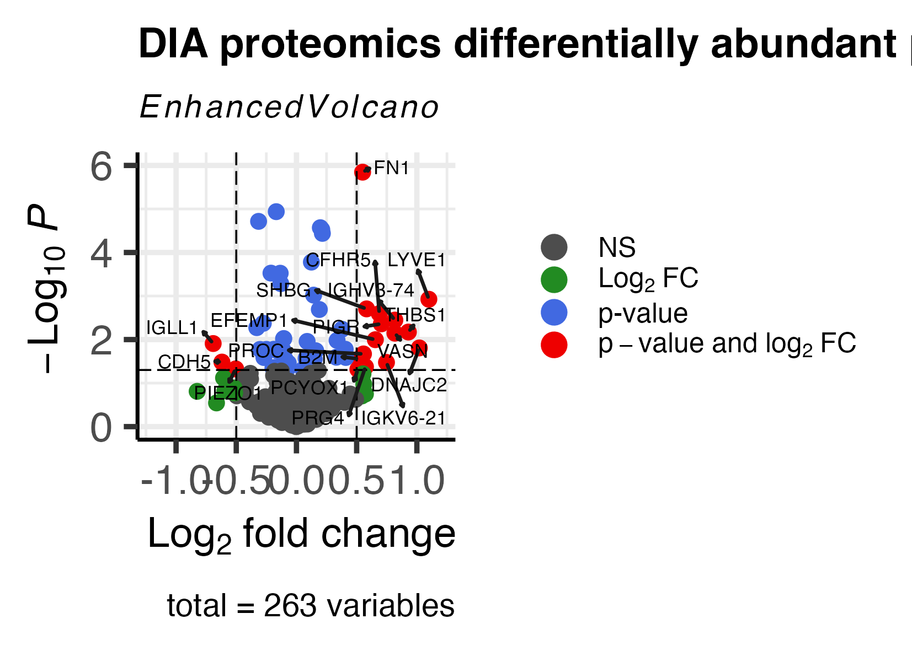

#
The mass spec files of raw data are searched and analysised usising proteome discoverer that byonic as a peptide seach node. this analysis workflow also uses a LFQ style quantifcation method using peak intnsities eaven when a sample does not a MS2 PSM corisponding to the peak in staed the peak is stilll quantifed on the basis that a PSM is found that in anouth sample that matches the peak's retention times.
```{r}
## Get started by loading the packages
library('tidyr')
library("knitr")
library("wrMisc")
library("wrProteo")
library("wrGraph")
library("readr")
library("ggplot2")
library("dplyr")
library("stringr")
library("purrr")
library("broom")
library("ggsignif")
library("viridis")
library("hrbrthemes")
library("janitor")
library(openxlsx2)


```


```{r}
setwd("/Users/thomasreilly/Desktop/MRes Data/10S_PD_quant")
```

```{r}
# Read as tab-separated file
Proteins <- read_tsv("10S_MECFS_GPEPS_250125_Proteins.txt")
ProteinGroups <- read_tsv("10S_MECFS_GPEPS_250125_ProteinGroups.txt")
PeptideGroups <- read_tsv("10S_MECFS_GPEPS_250125_PeptideGroups.txt")
PSMs <- read_tsv("10S_MECFS_GPEPS_250125_PSMs.txt")
ConsensusFeatures <- read_tsv("10S_MECFS_GPEPS_250125_ConsensusFeatures.txt")
InputFiles <- read_tsv("10S_MECFS_GPEPS_250125_InputFiles.txt")
PathwayProteinGroups <- read_tsv("10S_MECFS_GPEPS_250125_PathwayProteinGroups.txt")
StudyInformation <- read_tsv("10S_MECFS_GPEPS_250125_StudyInformation.txt")
ProteinAbundances <- read.csv("10S_MECFS_GPEPS_250125_Proteins_Abundances.csv")
```

```{r}
summary(Proteins)
```
First i Have attempted to do some explortory data analysis of the data by lookings at the data distrubtions of some of the key variables. Many varables show skewed histograms and will need Log transfomation to make their distrubion normal before moving ahead with statisical methods, as many staisical methods assume data normality. 

```{r}
PSMsPep2D <- PSMs$`PEP 2D`
hist(PSMsPep2D)
PSMsLogProb <- PSMs$`|Log Prob|`
hist(PSMsLogProb)
Peptide_Groups_PSM_Counts <- PeptideGroups$`# PSMs`
hist(Peptide_Groups_PSM_Counts)
hist(PeptideGroups$`Abundance Ratio (log2): (MECFS) / (Healthy)`)
hist(PeptideGroups$`Abundance Ratio: (MECFS) / (Healthy)`)
hist(ProteinGroups$`# Unique Peptides`)

hist(Proteins$`Abundances (Grouped): Healthy`)
hist(Proteins$`Abundances (Grouped): MECFS`)

```
```{r}
glycoPSMs <- PSMs %>% filter(!is.na(`Glycan Composition`)) # I think i may have forgot pep2D score filtering but it shoul have been done in PD using byonic as a node
```

```{r}
hist(glycoPSMs$`DeltaM [ppm]`)
hist(log10(glycoPSMs$Intensity))
hist(log(glycoPSMs$`PEP 2D`))
hist(glycoPSMs$`|Log Prob|`)
hist(log(glycoPSMs$`Precursor Abundance`))
hist(glycoPSMs$`Byonic Score`)
hist(glycoPSMs$`Delta Byonic Score`)
hist(glycoPSMs$`q-Value 2D`)
hist(glycoPSMs$`q-Value 1D`)

```

```{r}
glycoPSMs <- glycoPSMs %>%
  mutate(`Glycan Composition` = str_remove(`Glycan Composition`, "@ N \\| rare1$"))
```


```{r}
Glycans <- glycoPSMs %>%
  group_by(`Glycan Composition`) %>%
  summarise(count = n(), .groups = "drop")

png("glycan_barplot.png", width = 1600, height = 1200, res = 150)  # High-res image
par(mar = c(5, 15, 4, 2))
barplot(Glycans$count, 
        names.arg = Glycans$`Glycan Composition`, 
        horiz = TRUE,
        las = 1,
        col = "steelblue",
        main = "Glycan Composition Counts",
        xlab = "Count",
        cex.names = 0.9)
dev.off()  # Save the file

```
the following barchart of glycan PSM counts shows the plasma glycome is predominated by a few abundant glycans, thus skew the distrubution of abundances. this what we would expected and is simaly reflected in the released glycan analysis. 
```{r}
knitr::include_graphics("glycan_barplot.png")
```

```{r}
# Pivot the dataset from wide to long format
ProteinAbundances_long <- ProteinAbundances %>%
  pivot_longer(
    cols = starts_with("Abundance_"),  # Select columns dynamically
    names_to = "Sample",
    values_to = "Abundance"
  )
ProteinAbundances_long <- ProteinAbundances_long %>%
  mutate(
    Disease_Status = str_extract(Sample, "(?<=_)(Healthy|MECFS)$"),  # Extract "Healthy" or "MECFS"
    Sample = str_extract(Sample, "(?<=_)[^_]+(?=_)")  # Extract the middle part (Sample ID)
  )
ProteinAbundances_long <- ProteinAbundances_long %>%
  mutate(Abundance = replace_na(Abundance, 0))
```

Performed EDA on top 15 proteins while using glycopeptide data as as i wanted to advoid issues for my further statisical analysis that missing values could cause. 

```{r}
# Clean Protein_Names by removing everything including and after "OS="
ProteinAbundances_long <- ProteinAbundances_long %>%
  mutate(Protein_Names = sub("OS=.*", "", Protein_Names))  # Remove "OS=" and everything after it

# Select top 15 proteins by mean abundance
top_proteins <- ProteinAbundances_long %>%
  group_by(Protein_Names) %>%
  summarize(mean_abundance = mean(Abundance, na.rm = TRUE)) %>%
  arrange(desc(mean_abundance)) %>%
  slice_head(n = 15) %>%
  pull(Protein_Names)  # Extract protein names

# Filter dataset for only the top 15 proteins
ProteinAbundances_top15 <- ProteinAbundances_long %>%
  filter(Protein_Names %in% top_proteins)


# Create the heatmap
heatmap_plot <- ggplot(ProteinAbundances_top15, aes(x = Sample, y = Protein_Names, fill = Abundance)) +
  geom_tile(color = "white", height = 0.8) +
  scale_fill_viridis_c() +  # Corrected function
  theme_ipsum() +
  labs(
    title = "Top 15 Protein Abundance Heatmap",
    x = "Sample Name",
    y = "Protein",
    fill = "Abundance"
  ) +
  theme(
    axis.text.x = element_text(angle = 45, hjust = 1),
    axis.text.y = element_text(size = 10),
    panel.spacing = unit(1, "lines"),
    plot.margin = margin(10, 10, 10, 10)
  ) +
  scale_y_discrete(expand = expansion(mult = c(0.05, 0.05)))

ggsave("heatmap.png", plot = heatmap_plot, width = 10, height = 6, dpi = 300)

```

```{r display_plot, echo=FALSE, out.width="100%"}
knitr::include_graphics("Protein_Abundance_Heatmap_Top15.png")

```
```{r}
# Perform t-tests and extract results
Top15_ProtAbun_t_test_results <- ProteinAbundances_top15 %>%
  group_by(Protein_Names) %>%
  summarise(
    t_test = list(
      tryCatch(
        t.test(
          Abundance ~ Disease_Status, 
          data = pick(everything()),  # Use `pick()` instead of `cur_data()`
          var.equal = FALSE  # Welch's t-test
        ), 
        error = function(e) NULL  # Handle errors gracefully
      )
    ),
    .groups = "drop"
  ) %>%
  mutate(
    t_test_summary = map(t_test, ~ if (!is.null(.x)) broom::tidy(.x) else NULL)
  ) %>%
  unnest(cols = t_test_summary, keep_empty = TRUE) %>% # Expand results for each protein
  select(
    Protein_Names, 
    estimate, 
    p.value, 
    conf.low, 
    conf.high, 
    method  
  )

# Display t-test results in a table
knitr::kable(
  Top15_ProtAbun_t_test_results,
  caption = "Protein Abundance T-tests",
  digits = 4
)
```

Only one of the top 15 proteins was found to be statisically significantly diffent between the Healty and ME/CFS groups. this was Alpha 2 HS glycoprotein. please not the the i used the welch t test metho as thet this method does not assume equal varrineces between the groups. 
```{r}
# Define significance levels for annotation
Top15_ProtAbun_t_test_results <- Top15_ProtAbun_t_test_results %>%
  mutate(
    significance = case_when(
      p.value < 0.001 ~ "***",
      p.value < 0.01  ~ "**", 
      p.value < 0.05  ~ "*",
      TRUE            ~ "ns"
    ),
    # Format p-values for display
    p.value_label = case_when(
      p.value < 0.001 ~ "p < 0.001",
      p.value < 0.01 ~ sprintf("p = %.3f", p.value),
      p.value < 0.05 ~ sprintf("p = %.3f", p.value),
      TRUE ~ sprintf("p = %.3f", p.value)
    )
  )

# Merge significance results with original data
ProteinAbundances_top15 <- ProteinAbundances_top15 %>%
  left_join(Top15_ProtAbun_t_test_results, by = "Protein_Names")

# Create significance data for annotation with protein-specific y-positions
significance_data <- ProteinAbundances_top15 %>%
  group_by(Protein_Names) %>%
  summarize(
    max_abundance = max(Abundance, na.rm = TRUE),
    .groups = "drop"
  ) %>%
  left_join(Top15_ProtAbun_t_test_results, by = "Protein_Names") %>%
  mutate(
    group1 = "Healthy",
    group2 = "MECFS",
    # Add some padding above the maximum value for each protein
    y_position = max_abundance * 1.1
  )

# Create the plot
p <- ggplot(ProteinAbundances_top15, aes(x = Disease_Status, y = Abundance, fill = Disease_Status)) +
  geom_boxplot(outlier.color = "red", outlier.shape = 1) +
  scale_fill_viridis_c() + 
  # Add individual points for better data visualization
  geom_jitter(width = 0.2, alpha = 0.3, size = 1) +
  facet_wrap(
    ~Protein_Names, 
    ncol = 3,                  # Use 3 columns for better spacing
    scales = "free_y"          # Allow different y-scales for each protein
  ) +
  # Add significance brackets
  geom_segment(
    data = significance_data,
    aes(
      x = 1,
      xend = 2,
      y = y_position,
      yend = y_position
    ),
    inherit.aes = FALSE
  ) +
  # Add significance labels
  geom_text(
    data = significance_data,
    aes(
      x = 1.5,
      y = y_position * 1.05,
      label = paste(significance, "\n", p.value_label)
    ),
    inherit.aes = FALSE,
    size = 4  # Fix size for readability
  ) +
  theme_classic(base_size = 14) +  # Ensures a clean white background
  labs(
    title = "Box Plots of Top 15 Protein Abundances",
    x = "Disease Status",
    y = "Abundance"
  ) +
  scale_fill_manual(values = c("Healthy" = "blue", "MECFS" = "orange")) +
  theme(
    strip.text = element_text(size = 12, face = "bold"),
    axis.text.x = element_text(angle = 45, hjust = 1),
    axis.text = element_text(size = 10),
    axis.title = element_text(size = 14),
    plot.title = element_text(size = 16, face = "bold"),
    panel.spacing = unit(2, "lines"), # Increase space between plots
    plot.margin = margin(20, 20, 20, 20) # Add extra margin
  )

# Save the plot as a PNG file with high resolution
ggsave("Protein_Abundance_Boxplots.png", plot = p, width = 20, height = 18, dpi = 300, bg = "white")

```

```{r}


significance_data <- significance_data %>%
  select(Protein_Names, significance, p.value_label, y_position)

for (protein in unique(ProteinAbundances_top15$Protein_Names)) {
  clean_protein_name <- sub("OS=.*", "", protein)
  clean_protein_name <- trimws(clean_protein_name)

  protein_data <- ProteinAbundances_top15 %>% filter(Protein_Names == protein)
  sig_info <- significance_data %>% filter(Protein_Names == protein)

  p <- ggplot(protein_data, aes(x = Disease_Status, y = Abundance, fill = Disease_Status)) +
    geom_boxplot(outlier.color = "red", outlier.shape = 1) +
    geom_jitter(width = 0.2, alpha = 0.3, size = 1) +
    scale_fill_viridis_d(option = "D", labels = function(x) gsub("_", " ", x), begin = 0.2, end = 0.8) +
    theme_classic(base_size = 14) +
    labs(
      title = paste("Protein Abundance:", clean_protein_name),
      x = "Disease Status",
      y = "Abundance",
      fill = "Disease Status"
    ) +
    theme(
      strip.text = element_text(size = 14, face = "bold"),
      axis.text.x = element_text(angle = 45, hjust = 1, size = 12),
      axis.text = element_text(size = 12),
      axis.title = element_text(size = 14),
      plot.title = element_text(size = 18, face = "bold"),
      plot.margin = margin(20, 20, 20, 20),
      panel.background = element_rect(fill = "NA", color = "NA"),
      plot.background = element_rect(fill = "NA", color = "NA")
    )

  if (nrow(sig_info) > 0) {
    p <- p + 
      geom_segment(
        data = sig_info,
        aes(x = 1, xend = 2, y = y_position, yend = y_position),
        inherit.aes = FALSE
      ) +
      geom_text(
        data = sig_info,
        aes(x = 1.5, y = y_position * 1.05, label = paste(significance, " ", p.value_label)),
        inherit.aes = FALSE,
        size = 5
      )
  }

  filename <- paste0("Protein_Abundance_", gsub("[^A-Za-z0-9]", "_", clean_protein_name), ".png")
  ggsave(filename, plot = p, width = 8, height = 6, dpi = 300, bg = NA)

  print(paste("Saved:", filename))
}

```
```{r}
knitr::include_graphics("Protein_Abundance_Alpha_2_HS_glycoprotein.png")

```

```{r}
glycoPSMs <- glycoPSMs %>%
  mutate(
    Sample = str_extract(`Spectrum File`, "(?<=20250116_OE_TR_10S_MECFS_GPEP_)(.*?)(?=\\.raw)"),
    Disease_Status = ifelse(str_detect(Sample, "^HC"), "Healthy", 
                            ifelse(str_detect(Sample, "M"), "MECFS", NA)),
    Protein_Names = str_extract(`Master Protein Descriptions`, "^[^O]*(?=OS=)")
  )
```

```{r}
Alpha_2_HS_glycoprotein_GlycoPSMs <- glycoPSMs %>%
  filter(str_detect(Protein_Names, "Alpha-2-HS-glycoprotein"))
```

```{r}
# Summarize the glycan composition by Disease Status (Healthy or MECFS)
Alpha_2_HS_glycoprotein_glycan_summary <- Alpha_2_HS_glycoprotein_GlycoPSMs %>%
  group_by(Disease_Status, `Glycan Composition`) %>%
  summarise(count = n(), .groups = 'drop')  # Count occurrences of each glycan composition

# Create a bar chart of the summarized data
Alpha_2_HS_glycoprotein_glycans <- ggplot(Alpha_2_HS_glycoprotein_glycan_summary, aes(x = `Glycan Composition`, y = count, fill = Disease_Status)) +
  geom_bar(stat = "identity", position = "dodge") +  # Dodge for side-by-side bars
  theme_minimal() +
  labs(
    title = "Alpha 2 HS glycoprotein glycosolation by Disease Status",
    x = "Glycan Composition",
    y = "Spectral Count",
    fill = "Disease Status"
  ) +
  theme(
    axis.text.x = element_text(angle = 45, hjust = 1), # Rotate x-axis labels for better readability
    plot.title = element_text(size = 20, face = "bold"),
    axis.title = element_text(size = 16)
  )
# Save the plot
ggsave("Alpha_2_HS_glycoprotein_glycans.png", plot = Alpha_2_HS_glycoprotein_glycans, width = 16, height = 14, dpi = 300, bg = "white")

```

At the indivual glycan level the glycans that are found on Alpha 2 HS glycoprotein are simmular between groups. not the following graph only shows by spectral counts. it is more appropriate to nomalise to the relative percenatage of the protein's glycome. 
```{r}
knitr::include_graphics("Alpha_2_HS_glycoprotein_glycans.png")
```


```{r}
# Summarize the glycan composition by Disease Status (Healthy or MECFS)
Alpha_2_HS_glycoprotein_glycan_RA_summary <- Alpha_2_HS_glycoprotein_GlycoPSMs %>%
  group_by(Disease_Status, `Glycan Composition`) %>%
  summarise(count = n(), .groups = 'drop')  # Count occurrences of each glycan composition

# Calculate total count for each Disease Status (Healthy or MECFS)
total_counts <- Alpha_2_HS_glycoprotein_glycan_RA_summary %>%
  group_by(Disease_Status) %>%
  summarise(total_count = sum(count), .groups = 'drop')

# Merge total counts with the summary to calculate relative percentage
Alpha_2_HS_glycoprotein_glycan_RA_summary <- Alpha_2_HS_glycoprotein_glycan_RA_summary %>%
  left_join(total_counts, by = "Disease_Status") %>%
  mutate(percentage = (count / total_count) * 100)  # Calculate percentage of total count

# Create a bar chart of the relative percentage data
Alpha_2_HS_glycoprotein_RA_glycans <- ggplot(Alpha_2_HS_glycoprotein_glycan_RA_summary, aes(x = `Glycan Composition`, y = percentage, fill = Disease_Status)) +
  geom_bar(stat = "identity", position = "dodge") +  # Dodge for side-by-side bars
  scale_fill_viridis_d(option = "D", begin = 0.2, end = 0.8) +
  theme_minimal() +
  labs(
    title = "Alpha 2 HS Glycoprotein Glycosylation by Disease Status",
    x = "Glycan Composition",
    y = "Relative Percentage (%)",
    fill = "Disease Status"
  ) +
  theme(
    axis.text.x = element_text(angle = 45, hjust = 1), # Rotate x-axis labels for better readability
    plot.title = element_text(size = 20, face = "bold"),
    axis.title = element_text(size = 16)
  )

# Save the plot
ggsave("Alpha_2_HS_glycoprotein_glycans_relative_percentage.png", plot = Alpha_2_HS_glycoprotein_RA_glycans, width = 16, height = 14, dpi = 300, bg = "white")

```

The following graph show the relative percentage of the total glycome normalised data. 
```{r}
knitr::include_graphics("Alpha_2_HS_glycoprotein_glycans_relative_percentage.png")

```

```{r}
# Step 1: Create a new column indicating whether the Glycan Composition contains "NeuAc"
Alpha_2_HS_glycoprotein_GlycoPSMs <- Alpha_2_HS_glycoprotein_GlycoPSMs %>%
  mutate(contains_NeuAc = ifelse(str_detect(`Glycan Composition`, "NeuAc"), TRUE, FALSE))

# Step 2: Group by sample and count the total rows per sample
sample_counts <- Alpha_2_HS_glycoprotein_GlycoPSMs %>%
  group_by(Sample) %>%
  summarise(total_count = n(), .groups = 'drop')

# Step 3: Count rows that contain "NeuAc" based on the `contains_NeuAc` column
NeuAc_counts <- Alpha_2_HS_glycoprotein_GlycoPSMs %>%
  filter(contains_NeuAc == TRUE) %>%  # Filter for rows containing NeuAc
  group_by(Sample) %>%
  summarise(NeuAc_count = n(), .groups = 'drop')

# Step 4: Merge total counts and NeuAc counts by Sample
merged_counts <- sample_counts %>%
  left_join(NeuAc_counts, by = "Sample") %>%
  mutate(
    NeuAc_count = ifelse(is.na(NeuAc_count), 0, NeuAc_count),  # Replace NA with 0 if no NeuAc-containing rows
    NeuAc_percentage = (NeuAc_count / total_count) * 100  # Calculate percentage of NeuAc-containing glycans
  )

# Step 5: Merge with Disease_Status (assuming `Sample` or another column contains Disease_Status)
merged_counts <- merged_counts %>%
  left_join(Alpha_2_HS_glycoprotein_GlycoPSMs %>% select(Sample, Disease_Status) %>% distinct(), by = "Sample")

# Step 6: Perform T-test comparing the percentage of NeuAc-containing glycans between Disease Status groups
t_test_result <- t.test(NeuAc_percentage ~ Disease_Status, data = merged_counts)
print(t_test_result)

# Step 7: Create a boxplot to visualize the percentage of NeuAc-containing glycans by Disease Status
NeuAc_boxplot <- ggplot(merged_counts, aes(x = Disease_Status, y = NeuAc_percentage, fill = Disease_Status)) +
  geom_boxplot(outlier.color = "red", outlier.shape = 1) +
  geom_jitter(width = 0.2, alpha = 0.3, size = 2) +  # Add individual points
  theme_minimal() +
  labs(
    title = "Relative Percentage of NeuAc-Containing Glycans by Disease Status",
    x = "Disease Status",
    y = "Relative Percentage of NeuAc-Containing Glycans (%)",
    fill = "Disease Status"
  ) +
  theme(
    plot.title = element_text(size = 20, face = "bold"),
    axis.text.x = element_text(angle = 45, hjust = 1),
    axis.title = element_text(size = 16),
    axis.text = element_text(size = 14)
  )

# Step 8: Save the plot as a PNG file
ggsave("NeuAc_Containing_Glycans_Percentage_Boxplot.png", plot = NeuAc_boxplot, width = 12, height = 8, dpi = 300, bg = "white")
```
No difference of NeuAc containg glycans on Alpha 2 HS glycoprotein. as all of the the glycans are sialyted. 
```{r}
knitr::include_graphics("NeuAc_Containing_Glycans_Percentage_Boxplot.png")

```


```{r}
# 1. Create a new column indicating whether the Glycan Composition contains "Fuc"
Alpha_2_HS_glycoprotein_GlycoPSMs <- Alpha_2_HS_glycoprotein_GlycoPSMs %>%
  mutate(contains_Fuc = ifelse(str_detect(`Glycan Composition`, "Fuc"), "TRUE", "FALSE"))

# Example: Assuming `glycoPSMs` is your data and `contains_fuc` is a column that marks "Fuc"-containing glycans

# 1. Create the `contains_fuc` column if it's not already there
Alpha_2_HS_glycoprotein_GlycoPSMs <- Alpha_2_HS_glycoprotein_GlycoPSMs %>%
  mutate(contains_fuc = str_detect(`Glycan Composition`, "Fuc"))  # TRUE/FALSE logical value

# 2. Group by sample and count the total rows per sample
sample_counts <- Alpha_2_HS_glycoprotein_GlycoPSMs %>%
  group_by(Sample) %>%
  summarise(total_count = n(), .groups = 'drop')

# 3. Count rows that contain "Fuc" based on the `contains_fuc` column (correct filter)
fuc_counts <- Alpha_2_HS_glycoprotein_GlycoPSMs %>%
  filter(contains_fuc == TRUE) %>%  # Filter where `contains_fuc` is TRUE
  group_by(Sample) %>%
  summarise(fuc_count = n(), .groups = 'drop')

# 4. Merge total counts and Fuc counts by Sample
merged_counts <- sample_counts %>%
  left_join(fuc_counts, by = "Sample") %>%
  mutate(
    fuc_count = ifelse(is.na(fuc_count), 0, fuc_count),  # Replace NA with 0 if no Fuc-containing rows
    fuc_percentage = (fuc_count / total_count) * 100  # Calculate percentage of Fuc-containing glycans
  )


# 4. Merge the merged counts with Disease_Status (assuming `Sample` or another column contains Disease_Status)
# For example, you can directly join with the `glycoPSMs` data frame
merged_counts <- merged_counts %>%
  left_join(glycoPSMs %>% select(Sample, Disease_Status) %>% distinct(), by = "Sample")

# 5. Perform T-test comparing the percentage of Fuc-containing glycans between Healthy and MECFS groups
t_test_result <- t.test(fuc_percentage ~ Disease_Status, data = merged_counts)
print(t_test_result)

# 6. Create a boxplot to visualize the percentage of Fuc-containing glycans by Disease Status
fuc_boxplot <- ggplot(merged_counts, aes(x = Disease_Status, y = fuc_percentage, fill = Disease_Status)) +
  geom_boxplot(outlier.color = "red", outlier.shape = 1) +
  geom_jitter(width = 0.2, alpha = 0.3, size = 2) +  # Add individual points
  scale_fill_viridis_d(option = "D", begin = 0.2, end = 0.8) +
  theme_minimal() +
  labs(
    title = "Relative Percentage of Fuc-Containing Glycans by Disease Status",
    x = "Disease Status",
    y = "Relative Percentage of Fuc-Containing Glycans (%)",
    fill = "Disease Status"
  ) +
  theme(
    plot.title = element_text(size = 20, face = "bold"),
    axis.text.x = element_text(angle = 45, hjust = 1),
    axis.title = element_text(size = 16),
    axis.text = element_text(size = 14)
  )

# 7. Save the plot as a PNG file
ggsave("Fuc_Containing_Glycans_Percentage_Boxplot.png", plot = fuc_boxplot, width = 12, height = 8, dpi = 300, bg = "white")

```
slight change but not significantly different fucosolyation of Alpha 2 HS glycoprotein between,  ME/CFS and Healthy controls. 

```{r}
knitr::include_graphics("Fuc_Containing_Glycans_Percentage_Boxplot.png")

```

```{r}
Alpha_2_HS_glycoprotein_GlycoPSMs <- Alpha_2_HS_glycoprotein_GlycoPSMs %>%
  mutate(Pep_glycoSite = str_extract(Modifications, "(?<=N)\\d+(?=\\()"))

```

```{r}
Alpha_2_HS_glycoprotein_GlycoPSMs <- Alpha_2_HS_glycoprotein_GlycoPSMs %>%
  mutate(
    Pep_glycoSite = as.numeric(Pep_glycoSite),  # Ensure numeric
    Protein_glycoSite = `Position in Protein` + Pep_glycoSite - 1
  )
```

```{r}
Alpha_2_HS_glycoprotein_ASN156_gPSMs <- Alpha_2_HS_glycoprotein_GlycoPSMs %>%
  filter(Protein_glycoSite == 156)

Alpha_2_HS_glycoprotein_ASN176_gPSMs <- Alpha_2_HS_glycoprotein_GlycoPSMs %>%
  filter(Protein_glycoSite == 176)
```

```{r}
Alpha_2_HS_glycoprotein_ASN156_glycan_counts <- Alpha_2_HS_glycoprotein_ASN156_gPSMs %>%
  group_by(Sample, `Glycan Composition`) %>%  # Group by Sample and Glycan
  summarise(count = n(), .groups = "drop")  # Count occurrences
```

```{r}
Alpha_2_HS_glycoprotein_ASN156_glycan_counts <- Alpha_2_HS_glycoprotein_ASN156_glycan_counts %>%
  group_by(Sample) %>%
  mutate(
    total_count = sum(count),            # Total count per sample
    RA = (count / total_count) * 100 # Relative abundance (%)
    ) %>%
  ungroup()  # Remove grouping for a clean final dataset

```

```{r}
Alpha_2_HS_ASN156_barplot <- ggplot(Alpha_2_HS_glycoprotein_ASN156_glycan_counts, aes(x = `Glycan Composition`, y = RA, fill = Sample)) +
  geom_col(position = "dodge", alpha = 0.7) +  
  theme_minimal(base_size = 12) +  # Increase base font size
  scale_fill_viridis_d(option = "D", begin = 0.2, end = 0.8) +
  labs(
    title = str_wrap("Relative Abundance (RA) of Glycans in Alpha-2-HS Glycoprotein at ASN156", width = 60),
    x = "Glycan Composition",
    y = "Relative Abundance (%)",
    fill = "Sample"
  ) +
  theme(
    axis.text.x = element_text(angle = 45, hjust = 1, size = 8),  # Increase x-axis label size
    axis.text.y = element_text(size = 12),  # Increase y-axis label size
    plot.margin = margin(10, 10, 10, 10)  # Expand margins
  )
ggsave("Alpha_2_HS_ASN156_barplot.png", Alpha_2_HS_ASN156_barplot, bg ="white")
```
```{r}
knitr::include_graphics("Alpha_2_HS_ASN156_barplot.png")

```

```{r}
Alpha_2_HS_glycoprotein_ASN176_glycan_counts <- Alpha_2_HS_glycoprotein_ASN176_gPSMs %>%
  group_by(Sample, `Glycan Composition`) %>%  # Group by Sample and Glycan
  summarise(count = n(), .groups = "drop")  # Count occurrences
```

```{r}
Alpha_2_HS_glycoprotein_ASN176_glycan_counts <- Alpha_2_HS_glycoprotein_ASN176_glycan_counts %>%
  group_by(Sample) %>%
  mutate(
    total_count = sum(count),            # Total count per sample
    RA = (count / total_count) * 100 # Relative abundance (%)
    ) %>%
  ungroup()  # Remove grouping for a clean final dataset

```

```{r}
Alpha_2_HS_ASN176_barplot <- ggplot(Alpha_2_HS_glycoprotein_ASN176_glycan_counts, aes(x = `Glycan Composition`, y = RA, fill = Sample)) +
  geom_col(position = "dodge", alpha = 0.7) +  
  theme_minimal(base_size = 12) +  # Increase base font size
  scale_fill_viridis_d(option = "D", begin = 0.2, end = 0.8) +
  labs(
    title = str_wrap("Relative Abundance (RA) of Glycans in Alpha-2-HS Glycoprotein at ASN176", width = 60),
    x = "Glycan Composition",
    y = "Relative Abundance (%)",
    fill = "Sample"
  ) +
  theme(
    axis.text.x = element_text(angle = 45, hjust = 1, size = 8),  # Increase x-axis label size
    axis.text.y = element_text(size = 12),  # Increase y-axis label size
    plot.margin = margin(10, 10, 10, 10)  # Expand margins
  )
ggsave("Alpha_2_HS_ASN176_barplot.png", Alpha_2_HS_ASN176_barplot, bg = "white")
```
```{r}
knitr::include_graphics("Alpha_2_HS_ASN176_barplot.png")

```

```{r}
# Create the heatmap
heatmap_plot <- ggplot(Alpha_2_HS_glycoprotein_ASN156_glycan_counts, aes(x = Sample, y = `Glycan Composition`, fill = RA)) +
  geom_tile(color = "white") +  # Heatmap tiles with white borders
  scale_fill_viridis_c() +  # Color scale for RA values
  theme_ipsum() +  
  labs(
    title = str_wrap("Relative Abundance (RA) of Glycans in Alpha-2-HS Glycoprotein at ASN156", width = 60),
    x = "Sample Name",
    y = "Glycan Composition",
    fill = "RA (%)"
  ) +
  theme(
    axis.text.x = element_text(angle = 45, hjust = 1),
    axis.text.y = element_text(size = 10),
    panel.spacing = unit(1, "lines"),
    plot.margin = margin(10, 10, 10, 10)
  ) +
  scale_y_discrete(expand = expansion(mult = c(0.05, 0.05)))

# Save the heatmap
ggsave("Alpha-2-HS_ASN156_glycan_RA_heatmap.png", plot = heatmap_plot, width = 10, height = 6, dpi = 300, bg = "white")
```

```{r}
knitr::include_graphics("Alpha-2-HS_ASN156_glycan_RA_heatmap.png")

```

```{r}
# Create the heatmap
heatmap_plot_ASN176 <- ggplot(Alpha_2_HS_glycoprotein_ASN176_glycan_counts, aes(x = Sample, y = `Glycan Composition`, fill = RA)) +
  geom_tile(color = "white") +  # Heatmap tiles with white borders
  scale_fill_viridis_c() +  # Color scale for RA values
  theme_ipsum() +  
  labs(
    title = str_wrap("Relative Abundance (RA) of Glycans in Alpha-2-HS Glycoprotein at ASN176", width = 60),
    x = "Sample Name",
    y = "Glycan Composition",
    fill = "RA (%)"
  ) +
  theme(
    axis.text.x = element_text(angle = 45, hjust = 1),
    axis.text.y = element_text(size = 10),
    panel.spacing = unit(1, "lines"),
    plot.margin = margin(10, 10, 10, 10)
  ) +
  scale_y_discrete(expand = expansion(mult = c(0.05, 0.05)))

# Save the heatmap
ggsave("Alpha-2-HS_ASN176_glycan_RA_heatmap.png", plot = heatmap_plot_ASN176, width = 10, height = 6, dpi = 300, bg = "white")
```

```{r}
knitr::include_graphics("Alpha-2-HS_ASN176_glycan_RA_heatmap.png")

```

```{r}
Alpha_2_HS_glycoprotein_ASN176_glycan_counts <- Alpha_2_HS_glycoprotein_ASN176_glycan_counts %>%
mutate(
    Disease_Status = ifelse(str_detect(Sample, "^HC"), "Healthy", 
                            ifelse(str_detect(Sample, "M"), "MECFS", NA)),
    contains_Fuc = ifelse(str_detect(`Glycan Composition`, "Fuc"), "TRUE", "FALSE"),
    contains_NeuAc = ifelse(str_detect(`Glycan Composition`, "NeuAc"), TRUE, FALSE))

Alpha_2_HS_glycoprotein_ASN156_glycan_counts <- Alpha_2_HS_glycoprotein_ASN156_glycan_counts %>%
mutate(
    Disease_Status = ifelse(str_detect(Sample, "^HC"), "Healthy", 
                            ifelse(str_detect(Sample, "M"), "MECFS", NA)),
    contains_Fuc = ifelse(str_detect(`Glycan Composition`, "Fuc"), "TRUE", "FALSE"),
    contains_NeuAc = ifelse(str_detect(`Glycan Composition`, "NeuAc"), TRUE, FALSE))
```

`

```{r}
library(dplyr)
library(stringr)
library(ggplot2)
library(viridis)
library(hrbrthemes)
library(scales)

Alpha_2_HS_glycoprotein_GlycoPSMs <- Alpha_2_HS_glycoprotein_GlycoPSMs %>%
  mutate(Pep_glycoSite = str_extract(Modifications, "(?<=N)\\d+(?=\\()"))

Alpha_2_HS_glycoprotein_GlycoPSMs <- Alpha_2_HS_glycoprotein_GlycoPSMs %>%
  mutate(
    Pep_glycoSite = as.numeric(Pep_glycoSite),
    Protein_glycoSite = `Position in Protein` + Pep_glycoSite - 1
  )

Alpha_2_HS_glycoprotein_ASN156_gPSMs <- Alpha_2_HS_glycoprotein_GlycoPSMs %>%
  filter(Protein_glycoSite == 156)

Alpha_2_HS_glycoprotein_ASN176_gPSMs <- Alpha_2_HS_glycoprotein_GlycoPSMs %>%
  filter(Protein_glycoSite == 176)

Alpha_2_HS_glycoprotein_ASN156_glycan_counts <- Alpha_2_HS_glycoprotein_ASN156_gPSMs %>%
  group_by(Sample, `Glycan Composition`) %>%
  summarise(count = n(), .groups = "drop")

Alpha_2_HS_glycoprotein_ASN156_glycan_counts <- Alpha_2_HS_glycoprotein_ASN156_glycan_counts %>%
  group_by(Sample) %>%
  mutate(
    total_count = sum(count),
    RA = (count / total_count) * 100
  ) %>%
  ungroup()

Alpha_2_HS_ASN156_barplot <- ggplot(Alpha_2_HS_glycoprotein_ASN156_glycan_counts, aes(x = `Glycan Composition`, y = RA, fill = Sample)) +
  geom_col(position = "dodge", alpha = 0.7) +  
  theme_minimal(base_size = 12) +
  scale_fill_viridis_d(option = "D", begin = 0.2, end = 0.8) +
  labs(
    title = str_wrap("Relative Abundance (RA) of Glycans in Alpha-2-HS Glycoprotein at ASN156", width = 60),
    x = "Glycan Composition",
    y = "Relative Abundance (%)",
    fill = "Sample"
  ) +
  theme(
    axis.text.x = element_text(angle = 45, hjust = 1, size = 8),
    axis.text.y = element_text(size = 12),
    plot.margin = margin(10, 10, 10, 10)
  )
ggsave("Alpha_2_HS_ASN156_barplot.png", Alpha_2_HS_ASN156_barplot)

Alpha_2_HS_glycoprotein_ASN176_glycan_counts <- Alpha_2_HS_glycoprotein_ASN176_gPSMs %>%
  group_by(Sample, `Glycan Composition`) %>%
  summarise(count = n(), .groups = "drop")

Alpha_2_HS_glycoprotein_ASN176_glycan_counts <- Alpha_2_HS_glycoprotein_ASN176_glycan_counts %>%
  group_by(Sample) %>%
  mutate(
    total_count = sum(count),
    RA = (count / total_count) * 100
  ) %>%
  ungroup()

Alpha_2_HS_ASN176_barplot <- ggplot(Alpha_2_HS_glycoprotein_ASN176_glycan_counts, aes(x = `Glycan Composition`, y = RA, fill = Sample)) +
  geom_col(position = "dodge", alpha = 0.7) +  
  theme_minimal(base_size = 12) +
  scale_fill_viridis_d(option = "D", begin = 0.2, end = 0.8) +
  labs(
    title = str_wrap("Relative Abundance (RA) of Glycans in Alpha-2-HS Glycoprotein at ASN176", width = 60),
    x = "Glycan Composition",
    y = "Relative Abundance (%)",
    fill = "Sample"
  ) +
  theme(
    axis.text.x = element_text(angle = 45, hjust = 1, size = 8),
    axis.text.y = element_text(size = 12),
    plot.margin = margin(10, 10, 10, 10)
  )
ggsave("Alpha_2_HS_ASN176_barplot.png", Alpha_2_HS_ASN176_barplot)

heatmap_plot <- ggplot(Alpha_2_HS_glycoprotein_ASN156_glycan_counts, aes(x = Sample, y = `Glycan Composition`, fill = RA)) +
  geom_tile(color = "white") +
  scale_fill_viridis_c() +
  theme_ipsum() +  
  labs(
    title = str_wrap("Relative Abundance (RA) of Glycans in Alpha-2-HS Glycoprotein at ASN156", width = 60),
    x = "Sample Name",
    y = "Glycan Composition",
    fill = "RA (%)"
  ) +
  theme(
    axis.text.x = element_text(angle = 45, hjust = 1),
    axis.text.y = element_text(size = 10),
    panel.spacing = unit(1, "lines"),
    plot.margin = margin(10, 10, 10, 10)
  ) +
  scale_y_discrete(expand = expansion(mult = c(0.05, 0.05)))
ggsave("Alpha-2-HS_ASN156_glycan_RA_heatmap.png", plot = heatmap_plot, width = 10, height = 6, dpi = 300)

heatmap_plot_ASN176 <- ggplot(Alpha_2_HS_glycoprotein_ASN176_glycan_counts, aes(x = Sample, y = `Glycan Composition`, fill = RA)) +
  geom_tile(color = "white") +
  scale_fill_viridis_c() +
  theme_ipsum() +  
  labs(
    title = str_wrap("Relative Abundance (RA) of Glycans in Alpha-2-HS Glycoprotein at ASN176", width = 60),
    x = "Sample Name",
    y = "Glycan Composition",
    fill = "RA (%)"
  ) +
  theme(
    axis.text.x = element_text(angle = 45, hjust = 1),
    axis.text.y = element_text(size = 10),
    panel.spacing = unit(1, "lines"),
    plot.margin = margin(10, 10, 10, 10)
  ) +
  scale_y_discrete(expand = expansion(mult = c(0.05, 0.05)))
ggsave("Alpha-2-HS_ASN176_glycan_RA_heatmap.png", plot = heatmap_plot_ASN176, width = 10, height = 6, dpi = 300)

Alpha_2_HS_glycoprotein_ASN176_glycan_counts <- Alpha_2_HS_glycoprotein_ASN176_glycan_counts %>%
  mutate(
    Disease_Status = ifelse(str_detect(Sample, "^HC"), "Healthy", 
                            ifelse(str_detect(Sample, "M"), "MECFS", NA)),
    contains_Fuc = ifelse(str_detect(`Glycan Composition`, "Fuc"), "TRUE", "FALSE"),
    contains_NeuAc = ifelse(str_detect(`Glycan Composition`, "NeuAc"), TRUE, FALSE)
  )

Alpha_2_HS_glycoprotein_ASN156_glycan_counts <- Alpha_2_HS_glycoprotein_ASN156_glycan_counts %>%
  mutate(
    Disease_Status = ifelse(str_detect(Sample, "^HC"), "Healthy", 
                            ifelse(str_detect(Sample, "M"), "MECFS", NA)),
    contains_Fuc = ifelse(str_detect(`Glycan Composition`, "Fuc"), "TRUE", "FALSE"),
    contains_NeuAc = ifelse(str_detect(`Glycan Composition`, "NeuAc"), TRUE, FALSE)
  )

Alpha_2_HS_ASN156_Fuc_RA <- Alpha_2_HS_glycoprotein_ASN156_glycan_counts %>%
  filter(contains_Fuc == "TRUE") %>%
  group_by(Sample, Disease_Status) %>%
  summarise(total_Fuc_RA = sum(RA), .groups = "drop")

Alpha_2_HS_ASN156_Fuc_t_test <- t.test(total_Fuc_RA ~ Disease_Status, data = Alpha_2_HS_ASN156_Fuc_RA)
p_value <- Alpha_2_HS_ASN156_Fuc_t_test$p.value

p_label <- ifelse(p_value < 0.001, "***", 
                  ifelse(p_value < 0.01, "**", 
                         ifelse(p_value < 0.05, "*", "ns")))

y_max <- max(Alpha_2_HS_ASN156_Fuc_RA$total_Fuc_RA) * 1.05

boxplot_ASN156_Fuc_RA <- ggplot(Alpha_2_HS_ASN156_Fuc_RA, aes(x = Disease_Status, y = total_Fuc_RA, fill = Disease_Status)) +
  geom_boxplot(alpha = 0.7) +
  geom_jitter(width = 0.2, size = 2, alpha = 0.7) +
  theme_minimal(base_size = 12) +
  scale_fill_viridis_d(option = "D", begin = 0.2, end = 0.8) +
  labs(
    title = str_wrap("Comparison of Fucose-Containing Glycan RA at glycosite ASN156 Between Healthy and MECFS", width = 50),
    x = "Disease Status",
    y = "Relative abundance (%)"
  ) +
  theme(
    legend.position = "none",
    axis.text.x = element_text(size = 12),
    axis.text.y = element_text(size = 12),
    plot.margin = margin(10, 10, 10, 10)
  ) +
  geom_text(aes(x = 1.5, y = y_max, label = paste0("p = ", signif(p_value, 3), " (", p_label, ")")), size = 5)
ggsave("Fucose_Glycan_RA_Alpha_2_HS_ASN156_Comparison.png", boxplot_ASN156_Fuc_RA, width = 6, height = 5, dpi = 300, bg = "white")

Alpha_2_HS_ASN176_Fuc_RA <- Alpha_2_HS_glycoprotein_ASN176_glycan_counts %>%
  filter(contains_Fuc == "TRUE") %>%
  group_by(Sample, Disease_Status) %>%
  summarise(total_Fuc_RA = sum(RA), .groups = "drop")

Alpha_2_HS_ASN176_Fuc_t_test_result <- t.test(total_Fuc_RA ~ Disease_Status, data = Alpha_2_HS_ASN176_Fuc_RA)
p_value <- Alpha_2_HS_ASN176_Fuc_t_test_result$p.value

p_label <- ifelse(p_value < 0.001, "***", 
                  ifelse(p_value < 0.01, "**", 
                         ifelse(p_value < 0.05, "*", "ns")))

y_max <- max(Alpha_2_HS_ASN176_Fuc_RA$total_Fuc_RA) * 1.05

boxplot_ASN176_Fuc_RA <- ggplot(Alpha_2_HS_ASN176_Fuc_RA, aes(x = Disease_Status, y = total_Fuc_RA, fill = Disease_Status)) +
  geom_boxplot(alpha = 0.7) +
  geom_jitter(width = 0.2, size = 2, alpha = 0.7) +
  theme_minimal(base_size = 12) +
  scale_fill_viridis_d(option = "D", begin = 0.2, end = 0.8) +
  labs(
    title = str_wrap("Comparison of Fucose-Containing Glycan RA at glycosite ASN176 Between Healthy and MECFS", width = 50),
    x = "Disease Status",
    y = "Relative abundance (%)"
  ) +
  theme(
    legend.position = "none",
    axis.text.x = element_text(size = 12),
    axis.text.y = element_text(size = 12),
    plot.margin = margin(10, 10, 10, 10)
  ) +
  geom_text(aes(x = 1.5, y = y_max, label = paste0("p = ", signif(p_value, 3), " (", p_label, ")")), size = 5)
ggsave("Fucose_Glycan_RA_Alpha_2_HS_ASN176_Comparison.png", boxplot_ASN176_Fuc_RA, width = 6, height = 5, dpi = 300, bg = "white")

```
```{r}
knitr::include_graphics("Fucose_Glycan_RA_Alpha_2_HS_ASN176_Comparison.png")

```
```{r}
knitr::include_graphics("Fucose_Glycan_RA_Alpha_2_HS_ASN156_Comparison.png")

```


```{r}
write.csv(ProteinAbundances, file = "ProteinAbundances_wide.csv")
```

```{r}
write.csv(ProteinAbundances_long, file = "ProteinAbundances_long.csv")

```
the following was caluatated and ploted from the glycoprotein data. As you may notice there many immugoblulin proteins found to be differenaly aubandant based on this data. It may be better use the protein groups data instead as this will group the immugoblulin family proteins together in a way that lead to less false posivies generated by the spreaded divesity of immuloglin proteins can take. 
```{r}
# Perform t-tests and extract results
ProtAbun_t_test_results <- ProteinAbundances_long %>%
  group_by(Protein_Names) %>%
  summarise(
    t_test = list(
      tryCatch(
        t.test(
          Abundance ~ Disease_Status, 
          data = pick(everything()),  # Use `pick()` instead of `cur_data()`
          var.equal = TRUE  #students T-test
        ), 
        error = function(e) {message(paste("Error in", Protein_Names, ":", e$message)); NULL}  # Handle errors gracefully and log message
      )
    ),
    .groups = "drop"
  ) %>%
  mutate(
    t_test_summary = map(t_test, ~ if (!is.null(.x)) broom::tidy(.x) else NULL)
  ) %>%
  unnest(cols = t_test_summary, keep_empty = TRUE) %>% # Expand results for each protein
  mutate(
    p.adjusted = p.adjust(p.value, method = "BH"),  # Benjamini-Hochberg adjustment
      `-Log10_p.value` = -log10(p.adjusted)  # -Log10 transformation
    ) %>%
  left_join(
    ProteinAbundances_long %>%
      group_by(Protein_Names, Disease_Status) %>%
      summarise(mean_abundance = mean(Abundance, na.rm = TRUE), .groups = 'drop') %>%
      pivot_wider(names_from = Disease_Status, values_from = mean_abundance) %>%
      mutate(Fold_Change = MECFS / Healthy, Log2_FC = log2(Fold_Change)),
    by = 'Protein_Names'
  ) %>%
  select(
    Protein_Names, 
    estimate, 
    p.value, 
    p.adjusted, 
    `-Log10_p.value`,
    Fold_Change,
    Log2_FC, 
    conf.low, 
    conf.high, 
    method  
  )

# Display t-test results in a table
knitr::kable(
  ProtAbun_t_test_results,
  caption = "Protein Abundance T-tests with BH Adjustment",
  digits = 4,
  na = 'NA'
)

```

```{r}
  library("EnhancedVolcano")
```

```{r}

# Create a basic volcano plot
ggplot(data = ProtAbun_t_test_results, aes(x = Log2_FC, y = `-Log10_p.value`)) +
  geom_vline(xintercept = c(-1.2, 1.2), col = "gray", linetype = 'dashed') +
  geom_hline(yintercept = -log10(0.3), col = "gray", linetype = 'dashed') + 
         geom_point() +
  theme()
```

```{r}
library(ggrepel)

ProtAbun_t_test_results <- ProtAbun_t_test_results %>%
  filter(!is.na(Log2_FC) & !is.na(p.adjusted))

ProtAbun_t_test_results$p.adjusted[ProtAbun_t_test_results$p.adjusted == 0] <- 1e-300

Gprot_volcano <- EnhancedVolcano(
  ProtAbun_t_test_results,
  lab = ProtAbun_t_test_results$Protein_Names,
  x = 'Log2_FC',
  y = 'p.adjusted',
  xlim = c(-5, 5), # Adjust the range based on your data distribution
  ylim = c(0, max(ProtAbun_t_test_results$`-Log10_p.value`, na.rm = TRUE) + 0.08), # Set y-axis limits
  pCutoff = 0.3,  # Optional: Set a cutoff for significance
  FCcutoff = 1,    # Optional: Set a cutoff for fold change
  labSize = 3.0, # Optional: Adjust label size
  labCol = 'black',
  colAlpha = 1,
  legendPosition = 'none',
  legendLabSize = 12,
  legendIconSize = 4.0,
  drawConnectors = TRUE,
  widthConnectors = 0.75
)

ggsave("Gprot_volcano.png", width = 10, height = 8)
knitr::include_graphics("Gprot_volcano.png")
```

```{r}
library(openxlsx2)

```
Have done differenial protein aubance analysis of the Charlie's DIA protemics data, as this is more correct dataset to perform analysis on then compared to my own glycoproteomics data set. this is because the glycoproteomics datasets has been biased by glycopeptide enrichment, therefore this may lead to inaccurate quants due to possible greater llels of missing values . the glycoproteomics data set also suffer from being collected by a DDA exmerimental method as this is best for glycoproteoms as the chimeric spectra would lead to signifcant issues for glycan asigments to peptides. hthe DDA method further creates issues of missing values at random due to ticinal featues inherant in the method. 
```{r}
wb <- wb_load("/Users/thomasreilly/Desktop/MRes Data/10S_PD_quant/Charlie_DIA/MRCFS Proteomics Results.xlsx")
DIA_Prot_DiffAb <- wb %>% wb_to_df(sheet = "Comp1")
library(janitor)
DIA_Prot_DiffAb <- DIA_Prot_DiffAb %>% clean_names()

DIA_Prot_DiffAb <- DIA_Prot_DiffAb %>%
  select(-starts_with("na"))

DIA_Prot_DiffAb <- DIA_Prot_DiffAb %>%
  mutate(Log2_FC = log2(fc_proteins))
```


```{r}
DIA_prot_volcano <- EnhancedVolcano(
  DIA_Prot_DiffAb,
  lab = DIA_Prot_DiffAb$protein,
  title = "DIA proteomics differentially aubundant proteins",
  x = 'Log2_FC',
  y = 'pval_proteins',
  ylim = c(0, 6), # Adjust this based on your data
  xlim = c(-1.2, 1.2), # Adjust the range based on your data distribution
  pCutoff = 0.05,  # Optional: Set a cutoff for significance
  FCcutoff = 0.5,    # Optional: Set a cutoff for fold change
  labSize = 3.0, # Optional: Adjust label size
  labCol = 'black',
  colAlpha = 1,
  legendPosition = 'right',
  legendLabSize = 12,
  legendIconSize = 4.0,
  drawConnectors = TRUE,
  widthConnectors = 0.75
)

ggsave("DIA_prot_volcano.png", width = 10, height = 8)

```
```{r}
knitr::kable(
  DIA_Prot_DiffAb,
  caption = "DIA Protein Abundances",
  digits = 2,
  na = 'NA'
)
```

```{r}

```


```{r}
DIA_DAPs <- DIA_Prot_DiffAb %>% 
  filter(Log2_FC > 0.5 & pval_proteins < 0.05) 

write.csv(DIA_DAPs, file = "DIA_DAPs.csv")

knitr::kable(
  DIA_DAPs,
  caption = "DIA plasma proteomics - Differentaly Aubundant Proteins",
  digits = 2,
  na = 'NA'
)
```

```{r}
glycoPSMs <- glycoPSMs %>%
  clean_names() %>%
  mutate(
    pep_glycosite = str_extract(modifications, "(?<=N)\\d+(?=\\()"),
    protein_names = str_extract(master_protein_descriptions, "^[^O]*(?=OS=)"),
    gene_name = str_extract(master_protein_descriptions, "(?<=GN=).*?(?= PE=)"),
    contains_Fuc = str_detect(glycan_composition, "Fuc"),
    contains_NeuAc = str_detect(glycan_composition, "NeuAc"),
    pep_glycosite = as.numeric(pep_glycosite),
    protein_glycosite = position_in_protein + pep_glycosite - 1
  ) %>%
  mutate(
    sample = str_extract(spectrum_file, "(?<=GPEP_)[^\\.]+"),
    disease_status = ifelse(str_detect(sample, "HC"), "Healthy", 
                            ifelse(str_detect(sample, "M"), "MECFS", NA_character_))) 
 

```


```{r}
glycan_class_map <- read_csv(file = "glycan_class_map.csv")

```

```{r}
match_glycan_class <- function(input_df, reference_df) {
  # Ensure required columns exist
  if (!"glycan_composition" %in% colnames(input_df)) {
    stop("Column 'glycan_composition' not found in input dataframe")
  }
  if (!all(c("glycans", "glycan_class") %in% colnames(reference_df))) {
    stop("Columns 'glycans' and 'glycan_class' not found in reference dataframe")
  }
  
  # Convert to character and trim whitespace
  input_df$glycan_composition <- trimws(tolower(as.character(input_df$glycan_composition)))
  reference_df$glycans <- trimws(tolower(as.character(reference_df$glycans)))
  
  # Initialize an empty vector to store the matched glycan classes
  matched_classes <- vector("character", length = nrow(input_df))
  
  # Iterate over each glycan_composition in the input dataframe
  for (i in 1:nrow(input_df)) {
    glycan_comp <- input_df$glycan_composition[i]
    
    # Find the row in the reference dataframe that matches the glycan composition
    matched_row <- reference_df[reference_df$glycans == glycan_comp, ]
    
    # If a match is found, store the glycan_class, otherwise store NA
    if (nrow(matched_row) > 0) {
      matched_classes[i] <- matched_row$glycan_class[1]
    } else {
      matched_classes[i] <- NA
    }
  }
  
  # Add the matched glycan_class to the input dataframe
  input_df$glycan_class <- matched_classes
  
  return(input_df)
}


count_sia <- function(input_df) {
  # Ensure required column exists
  if (!"glycan_composition" %in% colnames(input_df)) {
    stop("Column 'glycan_composition' not found in input dataframe")
  }
  
  # Extract number of NeuAc occurrences and add as new column
  input_df$sia_count <- sapply(input_df$glycan_composition, function(x) {
    match <- regmatches(x, regexpr("neuac\\((\\d+)\\)", x, perl = TRUE))
    if (length(match) > 0) {
      paste("NeuAc", sub("neuac\\((\\d+)\\)", "\\1", match))
    } else {
      "NeuAc 0"
    }
  })
  
  return(input_df)
}

count_fuc <- function(input_df) {
  # Ensure required column exists
  if (!"glycan_composition" %in% colnames(input_df)) {
    stop("Column 'glycan_composition' not found in input dataframe")
  }
  
  # Extract number of Fuc occurrences and add as new column
  input_df$fuc_count <- sapply(input_df$glycan_composition, function(x) {
    match <- regmatches(x, regexpr("fuc\\((\\d+)\\)", x, perl = TRUE))
    if (length(match) > 0) {
      paste("Fucose", sub("fuc\\((\\d+)\\)", "\\1", match))
    } else {
      "Fucose 0"
    }
  })
  
  return(input_df)
}

```

```{r}
glycoPSMs <- glycoPSMs %>%
  count_sia() %>%
  count_fuc() %>%
  match_glycan_class(., glycan_class_map)  # Explicitly passing the second argument

```

```{r}
gly_prot_list <- glycoPSMs %>%
  dplyr::select(gene_name) %>%  # Ensure we are using dplyr's select
  distinct() %>%
  pull(gene_name) %>%
  list()  # Convert the vector to a list


  
```

```{r}
# Function to split glycoPSMs into a list of data frames by gene_name
split_by_gene <- function(data, gene_list) {
  gene_data_list <- lapply(gene_list, function(gene) {
    data %>% filter(gene_name == gene)
  })
  
  # Naming the list elements with gene names for easy identification
  names(gene_data_list) <- gene_list
  
  return(gene_data_list)
}


glycoPSM_list <- split_by_gene(glycoPSMs, gene_list)
```

```{r}
HP_Gpeps <- glycoPSM_list[["HP"]]
```

```{r}
Gpeps_compostion <- glycoPSMs %>%
  group_by(sample, glycan_composition) %>%
  summarise(sum_intensity = sum(intensity)) %>%
  pivot_wider(names_from = sample, values_from = sum_intensity)

write_csv(Gpeps_class, "Gpeps_class.csv")
```

```{r}
Gpeps_Fuc <- glycoPSMs %>%
  group_by(sample, contains_fuc) %>%
  summarise(sum_intensity = sum(intensity)) %>%
  pivot_wider(names_from = sample, values_from = sum_intensity)

write_csv(Gpeps_Fuc, "Gpeps_Fuc.csv")

```

```{r}
Gpeps_Sia <- glycoPSMs %>%
  group_by(sample, contains_neu_ac) %>%
  summarise(sum_intensity = sum(intensity)) %>%
  pivot_wider(names_from = sample, values_from = sum_intensity)

write_csv(Gpeps_Sia, "Gpeps_Sia.csv")

```

```{r}

# Function for Glycan Composition Table with Relative Abundance
glycomp_table <- function(input_df) {
  input_df %>%
    group_by(sample, glycan_composition) %>%
    summarise(sum_intensity = sum(intensity), .groups = "drop") %>%
    # Calculate the total intensity per sample
    group_by(sample) %>%
    mutate(total_intensity = sum(sum_intensity)) %>%
    # Calculate relative abundance for each group
    mutate(relative_abundance = (sum_intensity / total_intensity) * 100) %>%
    ungroup() %>%
    # Pivot only the relative abundance
    dplyr::select(-sum_intensity, -total_intensity) %>%
    pivot_wider(names_from = sample, values_from = relative_abundance)
}

# Function for Fuc Table (contains_fuc column) with Relative Abundance
fuc_table <- function(input_df) {
  input_df %>%
    group_by(sample, contains_fuc) %>%
    summarise(sum_intensity = sum(intensity), .groups = "drop") %>%
    # Calculate the total intensity per sample
    group_by(sample) %>%
    mutate(total_intensity = sum(sum_intensity)) %>%
    # Calculate relative abundance for each group
    mutate(relative_abundance = (sum_intensity / total_intensity) * 100) %>%
    ungroup() %>%
    # Pivot only the relative abundance
    dplyr::select(-sum_intensity, -total_intensity) %>%
    pivot_wider(names_from = sample, values_from = relative_abundance)
}

# Function for Sia Table (contains_neu_ac column) with Relative Abundance
Sia_table <- function(input_df) {
  input_df %>%
    group_by(sample, contains_neu_ac) %>%
    summarise(sum_intensity = sum(intensity), .groups = "drop") %>%
    # Calculate the total intensity per sample
    group_by(sample) %>%
    mutate(total_intensity = sum(sum_intensity)) %>%
    # Calculate relative abundance for each group
    mutate(relative_abundance = (sum_intensity / total_intensity) * 100) %>%
    ungroup() %>%
    # Remove sum_intensity and total_intensity, then pivot only the relative abundance
    dplyr::select(-sum_intensity, -total_intensity) %>%
    pivot_wider(names_from = sample, values_from = relative_abundance)
}

class_table <- function(input_df) {
  input_df %>%
    group_by(sample, glycan_class) %>%
    summarise(sum_intensity = sum(intensity), .groups = "drop") %>%
    # Calculate the total intensity per sample
    group_by(sample) %>%
    mutate(total_intensity = sum(sum_intensity)) %>%
    # Calculate relative abundance for each group
    mutate(relative_abundance = (sum_intensity / total_intensity) * 100) %>%
    ungroup() %>%
    # Pivot only the relative abundance
    dplyr::select(-sum_intensity, -total_intensity) %>%
    pivot_wider(names_from = sample, values_from = relative_abundance)
}

count_sia_table <- function(input_df) {
  input_df %>%
    group_by(sample, sia_count) %>%
    summarise(sum_intensity = sum(intensity), .groups = "drop") %>%
    # Calculate the total intensity per sample
    group_by(sample) %>%
    mutate(total_intensity = sum(sum_intensity)) %>%
    # Calculate relative abundance for each group
    mutate(relative_abundance = (sum_intensity / total_intensity) * 100) %>%
    ungroup() %>%
    # Pivot only the relative abundance
    dplyr::select(-sum_intensity, -total_intensity) %>%
    pivot_wider(names_from = sample, values_from = relative_abundance)
}

count_fuc_table <- function(input_df) {
  input_df %>%
    group_by(sample, fuc_count) %>%
    summarise(sum_intensity = sum(intensity), .groups = "drop") %>%
    # Calculate the total intensity per sample
    group_by(sample) %>%
    mutate(total_intensity = sum(sum_intensity)) %>%
    # Calculate relative abundance for each group
    mutate(relative_abundance = (sum_intensity / total_intensity) * 100) %>%
    ungroup() %>%
    # Pivot only the relative abundance
    dplyr::select(-sum_intensity, -total_intensity) %>%
    pivot_wider(names_from = sample, values_from = relative_abundance)
}
```

```{r}
Sia_list <- lapply(glycoPSM_list, Sia_table)
fuc_list <- lapply(glycoPSM_list, fuc_table)
glycomp_list <- lapply(glycoPSM_list, glycomp_table)
glyc_class_list <- lapply(glycoPSM_list, class_table)
````

```{r}
fuc_count_list <- lapply(glycoPSM_list, count_fuc_table)
sia_count_list <- lapply(glycoPSM_list, count_sia_table)
```

```{r}
fix_list_names <- function(data_list) {
  names(data_list) <- ifelse(is.na(names(data_list)) | names(data_list) == "", 
                             paste0("Sheet_", seq_along(data_list)), 
                             names(data_list))
  return(data_list)
}

# Fix names for all lists
Sia_list <- fix_list_names(Sia_list)
glycomp_list <- fix_list_names(glycomp_list)
glyc_class_list <- fix_list_names(glyc_class_list)
fuc_count_list <- fix_list_names(fuc_count_list)
sia_count_list <- fix_list_names(sia_count_list)
fuc_list <- fix_list_names(fuc_list)


```

```{r}

# Function to save a list of data frames into an Excel workbook
save_list_to_excel <- function(data_list, file_name) {
  
  # Ensure all elements have valid names
  names(data_list) <- ifelse(is.na(names(data_list)) | names(data_list) == "", 
                             paste0("Sheet_", seq_along(data_list)), 
                             names(data_list))
  
  # Create a new workbook
  wb <- wb_workbook()
  
  # Add each data frame to a separate sheet in the workbook
  for (name in names(data_list)) {
    wb$add_worksheet(name)  # Add worksheet with corrected name
    wb$add_data(sheet = name, x = data_list[[name]])  # Write data
  }
  
  # Save the workbook
  wb$save(file_name)
}

# Apply the function to multiple lists
#save_list_to_excel(Sia_list, "glyprot_sia.xlsx")
#save_list_to_excel(glycomp_list, "glyprot_glycomp.xlsx")
#save_list_to_excel(glyc_class_list, "glyprot_class.xlsx")
save_list_to_excel(fuc_count_list, "glyprot_fuc_count.xlsx") # bug with the output of this  
save_list_to_excel(sia_count_list, "glyprot_sia_count.xlsx") # bug with the output of this 
#save_list_to_excel(fuc_list, "glyprot_fuc.xlsx")

```

```{r}

```

